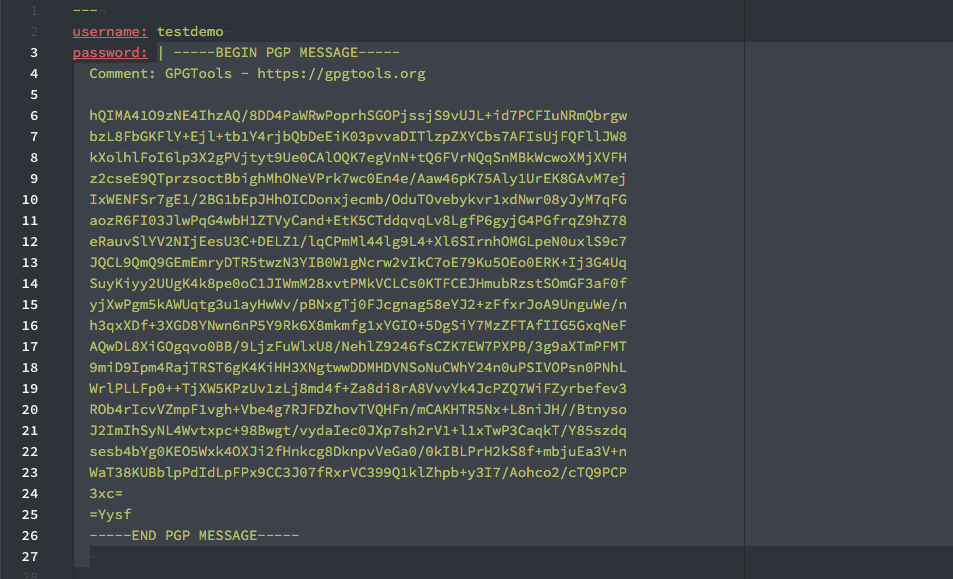

# atom-gpg package

GPG Encryption for Atom. Encrypts and decrypts selected text.

## Install

### Dependencies

  - gpg

```bash
$ apm install atom-gpg
```

Or install trough Atom Packages.

## Settings

  - **Gpg Executable**

    Path to GPG binary. Defaults to 'gpg'

  - **Gpg Home Dir**

    Path to GPG key directory.

  - **Gpg Recipients**

    Recipient User IDs seperated by comma (,). Add your own User ID here so you can decrypt text.

  - **Gpg Recipients File**

    File of recipient User IDs that are appended to Gpg Recipients. If only filename is given, it's searched from project workdir or same directory as text buffer file is in.

## Usage

Select text and press ```ctrl-shift-e``` to encrypt or ```ctrl-shift-d``` to decrypt.

Optionally you can also use context menu with right mouse button and select either _GPG Encrypt_ or
_GPG Decrypt_. Same options can be found under menu __Packages__ -> __GPG__.

You can encrypt and decrypt multiple selections.

NOTE: If Atom fails to find GPG in the PATH, you can set the path to the binary in Settings page!

### Recipients

You need to specify recipients to encryption. You can either specify them in Settings `Gpg recipients` or have `gpg.recipients` (name of the file can be changed in the settings) file in the same directory or in root of Git repo. User IDs in the file will be appended to recipients define in the Settings.

## YAML files

When encrypting secrets in YAML files, atom-gpg will add '|' character and indent the following lines:


